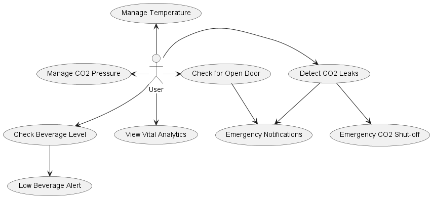
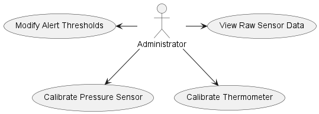

# Smart Beverage Dispensing System

ESP32S SOC-Powered Control System for Precision Pressurized Beverage Dispensing

## About The Project

This project's concept emerged the morning after we successfully completed our DIY Beverage Fridge. After a night of celebration toasting our creation, the next morning, we excitedly attempted to pour a refreshing beverage from the tap, only to be met with disappointment – nothing came out! We had already developed splitting headaches, which we initially attributed to our enthusiastic celebration. However, after some troubleshooting, we discovered that all of the CO2 had leaked out of our tank. This posed not only a health concern, because breathing CO2 is nowhere near as fun as oxygen, but it also put a strain on our already tight college student budgets, as refilling CO2 isn't exactly free.

A logical person would have pinpointed the leak, fixed it, and moved on, but I'm not your typical individual; I'm an engineer! At the time, I was also immersed in the world of smart home technology, and I saw an opportunity to turn my predicament into a solution for various problems.

The first feature I knew I wanted to incorporate was CO2 monitoring, given that it was the issue that sparked this idea in the first place. I envisioned a system that could detect CO2 concentration levels around the fridge, providing users with real-time data and, more importantly, sending alerts when CO2 levels exceeded safe thresholds.

Next, I wanted to tackle pressure management. Our kegerator was designed with an internal CO2 tank to minimize heat exchange with the environment – every hole in the fridge could potentially let heat in. While this design ensured better insulation, it made adjusting the dispensing pressure a cumbersome process. Whenever we needed to modify the pressure, we had to open the door, carefully remove both the keg and the CO2 tank, make rapid adjustments to the regulator, and then swiftly reassemble everything. We soon learned that if we took too long to make adjustments, the gas in the CO2 tank would expand, leading to inaccurate pressure readings once it was placed back inside the fridge.

Subsequently, I decided that if pressure could be controlled remotely, then temperature should follow suit. Remote temperature control is invaluable for serving kegged beverages, such as craft beer and artisanal sodas, as certain specialty drinks demand precise dispensing temperatures. The conventional "Cold, Colder, Coldest" controls found on most fridges fall short in allowing users to achieve such precision.

In addition to these innovative features, I was determined to develop an exceptional user interface that seamlessly integrates with our DIY Beverage Fridge. This interface, envisioned as a versatile web application accessible from both computers and smartphones, plays a pivotal role in the success of this project. I firmly believe that a robust and reliable user interface will be the key factor that elevates this endeavor from a simple DIY project to a practical and valuable solution for anyone seeking precise control over their beverage dispensing experience. With a user-friendly interface, we aim to simplify the management of CO2 levels, pressure, and temperature, enhancing the overall convenience and functionality of our creation. This endeavor reflects my passion for engineering solutions that bring efficiency and satisfaction to users' lives.

## Project Planning and Diagrams

As I embarked on the journey of creating our Smart Beverage Dispensing System, I quickly realized that to bring this innovative concept to life, I needed more than just enthusiasm and creativity. The project's complexity required a structured approach to gather and organize my thoughts, ideas, and requirements efficiently. To achieve this, I turned to PlantUML, a versatile tool for creating UML diagrams. UML (Unified Modeling Language) has proven invaluable in visually representing the various aspects of this project, from user interactions to system architecture. One of the key advantages of using PlantUML is its flexibility; it allows me to make changes to the diagrams quickly and seamlessly. As updates and refinements are made to the project's design, these changes automatically reflect in the diagrams presented in this readme, making my documentation process as seamless as possible and allowing me to spend more time and energy focusing on developing instead of documenting.

## User Experience

The Smart Beverage Dispensing System is designed to cater to a diverse user base, offering a user-friendly experience for all. Whether you're new to pressurized beverage systems or an experienced enthusiast, this system aims to make beverage dispensing hassle-free and intuitive.

To ensure a seamless experience for most users, interactions are streamlined and user-friendly. However, I also recognize the importance of catering to enthusiasts who may desire advanced control and in-depth monitoring capabilities. To accommodate this, the user experience is divided into two categories.

### Standard User Interactions

This section presents standard user interactions for monitoring and managing CO2 pressure, temperature, and beverage levels.

- **Manage CO2 Pressure:** Allows the user to monitor and adjust the CO2 pressure of the system remotely.

- **Manage Temperature:** Enables the user to remotely monitor and adjust the temperature inside the beverage fridge.

- **Detect CO2 Leaks:** Provides real-time monitoring of CO2 concentration levels and sends alerts if they exceed safe thresholds.

- **Check for Open Door:** Detects if the fridge door is left open, ensuring beverage quality and energy efficiency.

- **Check Beverage Level:** Estimates the remaining beverage in the keg and alerts the user when it's running low.

- **View Vital Analytics:** Provides access to analytics, including temperature and pressure data over time.

- **Emergency Notifications:** Handles alerts for CO2 leaks and open doors, ensuring user safety.

- **Emergency CO2 Shut-off:** Automatically closes the CO2 valve in case of a leak and reports the action taken.

- **Low Beverage Alert:** Alerts the user when the beverage level in the keg is low, preventing unexpected shortages.

### Advanced User Interactions

For users seeking advanced features or system maintenance, an administrator role will be available. Administrators will gain access to raw sensor data, calibration tools, and customization of emergency alert thresholds. This layer builds upon the standard user experience, catering to users with varying levels of expertise and offering a versatile system.

## Components

- 1x ESP32S Development Board
- 1x Digital Pressure Gauge w/ 1/4" NPT Fitting - https://shorturl.at/jkrtI
- 1x DS18B20 Temperature Sensor

## Pressure Regulation
The development of the pressure regulation system took part in two smaller endeavors. First, we needed a way to measure the pressure in the system in a useable way, and then we needed to design an apparatus to control the physical pressure dial on the CO2 regulator that is attaached to the tank.

To read the pressure from the sensor, I noticed that the CO2 regulator that our system used had an extra 1/4" fitting that I could connect a second gauge to. I couldn't find a standalone pressure sensor that had the fitting that I needed, so I ordered a digital pressure sensor on Amazon that I planned on using to read pressure data from our system.

The gauge that I bought was powered by 2 AAA batteries, and I knew that I wanted this system to be as maintenance free, so I wanted to replace the battery power with constant power. I removed the connections on the PCB that drew power from the batteries, and soldered on positive and negative power wires, connecting the positive wire to the 3.3V pin of the ESP and the negative to a ground pin. This configuration works because the AAA batteries, which have a voltage of ~1.5V each, were wired in series, creating a total voltage for the circuit of 3.3V

Once I had reliable power to the pressure gauge, I needed to determine how to get the signal from the pressure sensor on the PCB. Looking at the available soldiering pads on the back, I decided to try soldering onto the pads labeled S+ and S-, assuming that the S stood for signal. After making those connections, I used an the Osciloscope on my Digilant Analog Discovery board to verify that I was getting a signal from the sensor. When I pressed the on/off button to turn on the sensor, I saw a jump in the voltage detected from the "S" pads, confirming that the S pads were infact signal pads.

Now that I could read a signal from the sensor,  I needed to develop a way to process the information that this signal is giving. First, I wanted to start creating a simulation for the entire project, so I could design software for the system without having to constantly reflash the ESP. I am using Wokwi to do that. I utilized the ESP32 template available on the homepage to start the design process. This template for testing software configurations and interactions without the need for rewiring physical hardware.

As expected, Wokwi did not have any version of a pressure sensor available for simulation so I had to create my own. I did this using the custom chip functionality in the simulation builder. I gave the pressure gauge chip VCC, Ground, S+ and S- pins, and designed pressure-gauge.chip.c to calculate the output voltage in a function called calculate_voltage_from_psi. In this function, I can create an accurate algorithm to simulate the response of the sensor.

To determine the correct voltage to output at certain pressures, I connected a digital gauge that still had an LCD screen and my PCB to the regulator, and a recorded the voltage at 0.5 PSI increments (the resolution of the working digital gauge is 0.5 PSI).

## Temperature Regulation

## 